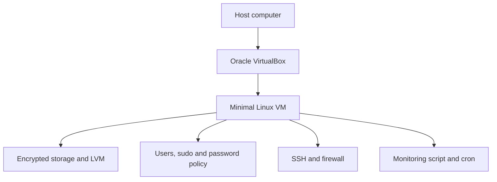

# Born2beRoot

> A practical Linux system-administration lab built around virtualization, secure configuration, storage design, service management, and automated monitoring.

[](https://www.kernel.org/)
[](https://www.virtualbox.org/)
[](https://www.debian.org/)
[](https://rockylinux.org/)
[](script.sh)

Born2beRoot is not simply “install Linux in VirtualBox.” Its real purpose is to build a minimal server, reduce its attack surface, justify its storage and security choices, and prove that the resulting system behaves as intended.

This repository is a learning reference and implementation companion. The official subject provided by 42 is always the source of truth for evaluation requirements.

## What this project teaches

By completing and defending this project, you should be able to explain:

- How a hypervisor turns physical resources into virtual hardware.
- The difference between a host, guest, VM, container, ISO, virtual disk, and snapshot.
- How Debian and Rocky Linux differ in packages, security tooling, and administration.
- Why partitions, encryption, filesystems, mount points, and LVM are separate layers.
- How users, groups, PAM, sudo, SSH, firewalls, AppArmor/SELinux, and systemd work together.
- How to inspect a server instead of assuming a configuration is active.
- How a Bash monitoring script collects metrics and how cron schedules it.

## Architecture



## Repository guide

| Resource | What it covers |
|---|---|
| [VirtualBox setup](docs/virtualbox-setup.md) | VM concepts, ISO verification, virtual hardware, NAT, port forwarding, snapshots |
| [Debian vs Rocky](docs/debian-vs-rocky.md) | Open-source status, release families, APT/DPKG, DNF/RPM, UFW/firewalld, AppArmor/SELinux |
| [Storage and LVM](docs/storage-and-lvm.md) | Partitions, mount points, LUKS, PV/VG/LV, swap, inspection commands |
| [Services and security](docs/services-and-security.md) | SSH, firewall, sudo, PAM/password policy, users, groups, service validation |
| [Monitoring and cron](docs/monitoring-and-cron.md) | Script installation, `crontab -e`, schedule syntax, metrics, verification |
| [script.sh](script.sh) | The system monitoring implementation |

## Recommended learning path

1. Read the official subject completely and write down every mandatory rule.
2. Learn the VM model and create the VirtualBox machine.
3. Install a minimal Debian or Rocky system without a graphical environment.
4. Design the required encrypted/LVM storage layout.
5. Configure hostname, users, groups, password aging, and password quality.
6. Apply a restricted sudo policy and verify its logs.
7. Configure SSH and open only the required firewall port.
8. Confirm mandatory access control and required services.
9. Install the monitoring script and schedule it with root's crontab.
10. Reboot and validate everything from a fresh state.
11. Practice explaining every decision without depending on copied commands.

## Quick inspection checklist

The exact expected output depends on the selected distribution and the current subject.

```bash
# Identity and operating system
hostnamectl
cat /etc/os-release
uname -a

# Storage
lsblk -f
findmnt
df -h
sudo pvs
sudo vgs
sudo lvs

# Users and privilege
id
getent group sudo
sudo -l
sudo chage -l "$USER"

# Services and network
systemctl --type=service --state=running
ss -lntup
ip address
ip route

# Debian firewall / security
sudo ufw status verbose
sudo aa-status

# Rocky firewall / security
sudo firewall-cmd --list-all
getenforce

# Automation
sudo crontab -l
sudo /usr/local/sbin/monitoring.sh
```

## Monitoring script

The included [script.sh](script.sh) reports:

- Kernel architecture
- Physical CPU sockets and virtual CPUs
- RAM and disk usage
- CPU utilization
- Last boot
- LVM presence
- Established TCP connections
- Logged-in users
- Primary IP and MAC address
- Recorded sudo commands

Install and schedule it:

```bash
sudo install -o root -g root -m 755 script.sh /usr/local/sbin/monitoring.sh
sudo /usr/local/sbin/monitoring.sh
sudo crontab -e
```

Add the required schedule:

```cron
*/10 * * * * /usr/local/sbin/monitoring.sh
```

See [Monitoring Script and cron](docs/monitoring-and-cron.md) for a full explanation of `crontab -e`, every metric, and verification commands.

## Debian or Rocky?

Neither distribution is “the closed-source option”: both are open source.

- **Debian** uses DEB packages, APT/DPKG, commonly UFW, and commonly AppArmor.
- **Rocky Linux** uses RPM packages, DNF/RPM, commonly firewalld, and SELinux.

Choose only an option allowed by the current project subject, then learn its tooling deeply enough to defend it. See the [full comparison](docs/debian-vs-rocky.md).

## Security model

The configuration is stronger when controls overlap:

| Layer | Control | Question it answers |
|---|---|---|
| Authentication | PAM and password policy | Can this identity log in? |
| Authorization | Users, groups, sudo | What may this identity do? |
| Network | SSH and firewall | Which remote entry points exist? |
| Process confinement | AppArmor or SELinux | What may a compromised process access? |
| Storage | LUKS, LVM, mount design | How is data protected and isolated? |
| Accountability | journald and sudo logs | Can privileged activity be inspected? |
| Automation | cron and monitoring | Is system state reported consistently? |

No single setting makes a server secure. Security comes from minimal services, explicit permissions, layered controls, updates, verification, and the ability to recover safely.

## Common mistakes

- Installing a graphical desktop without checking the subject.
- Opening a firewall port while the service listens on a different port.
- Reloading SSH without first running `sshd -t`.
- Editing sudoers without `visudo`.
- Copying PAM rules and locking every account out.
- Confusing a partition, filesystem, mount point, encryption layer, and logical volume.
- Omitting `-a` in `usermod -aG` and removing other group memberships.
- Assuming a snapshot is a backup.
- Running commands successfully but being unable to explain their effect.
- Following an old checklist instead of the current official subject.

## Evaluation mindset

A strong defense is evidence-driven. For each requirement, prepare:

1. The purpose of the control.
2. The configuration file or command that implements it.
3. A command that proves it is active.
4. The failure mode it prevents.
5. The trade-off or limitation it introduces.

The goal is not to memorize terminal commands. The goal is to understand the small Linux server you built.

## Responsible use

This repository is educational. Commands affecting authentication, storage, SSH, or firewall access can lock you out or destroy data when used incorrectly. Test in a disposable VM, keep console access, take backups, and adapt every setting to the current subject and environment.

## Author

**Mohammad Alhindi**  
Cloud Computing graduate · DevOps, Linux, Cloud & System Administration

[GitHub profile](https://github.com/mohammadalhindi1)

---

If this repository helped you understand the project, consider starring it. More importantly, rebuild the system yourself and be able to defend every configuration choice.
