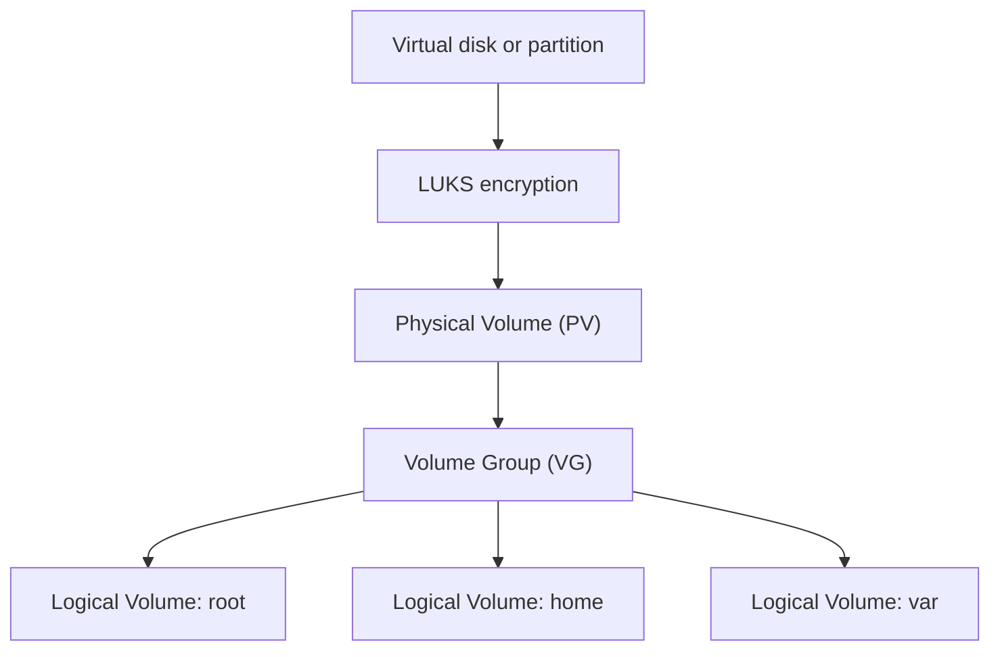

# Partitioning, Encryption, and LVM

Partitioning separates responsibilities, limits how one workload can affect another, and makes storage policies easier to manage.

## Concepts

- **Disk:** the virtual block device, commonly `/dev/sda`.
- **Partition:** a defined region such as `/dev/sda1`.
- **Filesystem:** the format that stores files, such as ext4 or XFS.
- **Mount point:** where a filesystem appears, such as `/home`.
- **LUKS:** common Linux encryption for data at rest.
- **LVM:** a flexible storage-allocation layer.

## LVM model



A Physical Volume gives storage to LVM. A Volume Group pools it. Logical Volumes are flexible virtual partitions created from that pool.

## Why separate mount points?

| Mount | Purpose | Benefit |
|---|---|---|
| `/` | Base operating system | Protects core capacity |
| `/home` | User data | Contains user growth |
| `/var` | Variable application data | Contains caches and service data |
| `/var/log` | Logs | A log flood is less likely to fill root |
| `/var/log/audit` | Audit records | Isolates audit growth |
| `/var/tmp` | Persistent temporary files | Separate policy/capacity |
| `/srv` | Hosted service data | Clear service boundary |
| `/tmp` | Temporary files | Supports restrictive mount options |
| swap | Memory pressure support | Disk-backed virtual memory |

Separate storage is not automatically secure; it still needs sensible sizing, permissions, and mount options.

## Inspect the layout

```bash
lsblk -f
findmnt
df -h
sudo pvs
sudo vgs
sudo lvs
swapon --show
```

Encryption protects a copied or stolen virtual disk, but not data after the system is unlocked and compromised. Before resizing storage, take a real backup and test on a disposable VM.
